# 🏁 RaceAnalytics

🏆 **Winner — BMW x Constructor Knowledge Labs  GenAI Hackathon 2026 (Autonomous Racing Track)**  
Our team built RaceAnalytics during a 3-day hackathon and won the **Constructor Knowledge Labs track** focused on autonomous racing and decision systems.

---

## 🧠 Problem Statement

Motorsport is one of the most data-intensive sports, yet most drivers receive little to no structured coaching.

Drivers:

- Record laps, but get no actionable feedback
- Work with fragmented data (telemetry, video, notes across tools)
- Cannot afford professional coaching at scale
- Lack a clear way to track progress and improvement

At the same time, the available data is extremely rich:

- High-frequency telemetry (speed, throttle, brake, steering, G-forces)
- Multi-sensor inputs (cameras, LiDAR, GNSS, IMU)
- Per-wheel and track boundary data

👉 **Challenge:**  
Build an intelligent system that transforms raw racing data into actionable insights, feedback, and real-time guidance — effectively acting as a _personal race engineer_.

---

## 🎥 Demo

RaceAnalytics provides two core modes:

- **Live Mode** — real-time feedback while the car is driving
- **Offline Mode** — post-lap analysis and insights dashboard

> ⚠️ Note: The AI co-driver (copilot API) is disabled in this demo version.

---

### 🟢 Live Mode (Real-Time)

While the car is on track, RaceAnalytics processes telemetry and provides real-time guidance and insights.

[▶️ Watch Live Demo](./assets/live%20video.mp4)

---

### 🔵 Offline Mode (Post-Lap Analysis)

After the session, drivers can analyze performance in detail through the dashboard.

#### 🏠 Home Dashboard
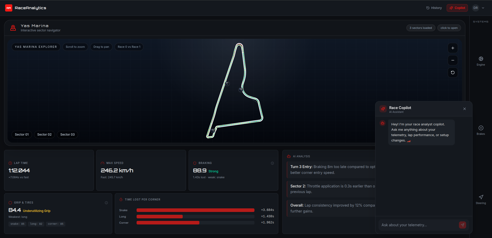

---

#### 🗺️ Track Sections Analysis
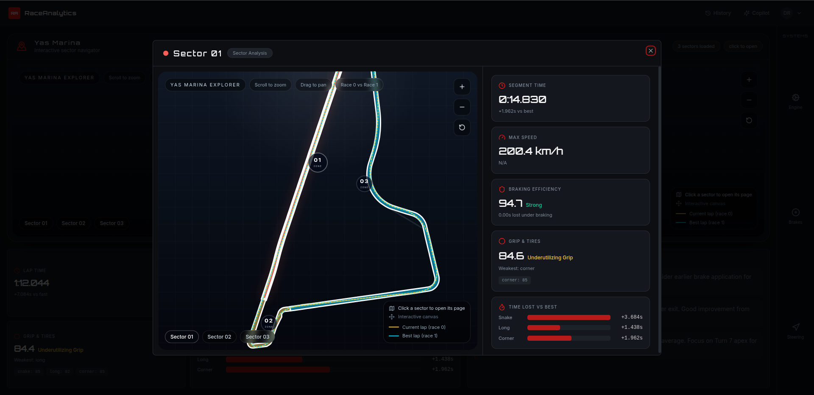
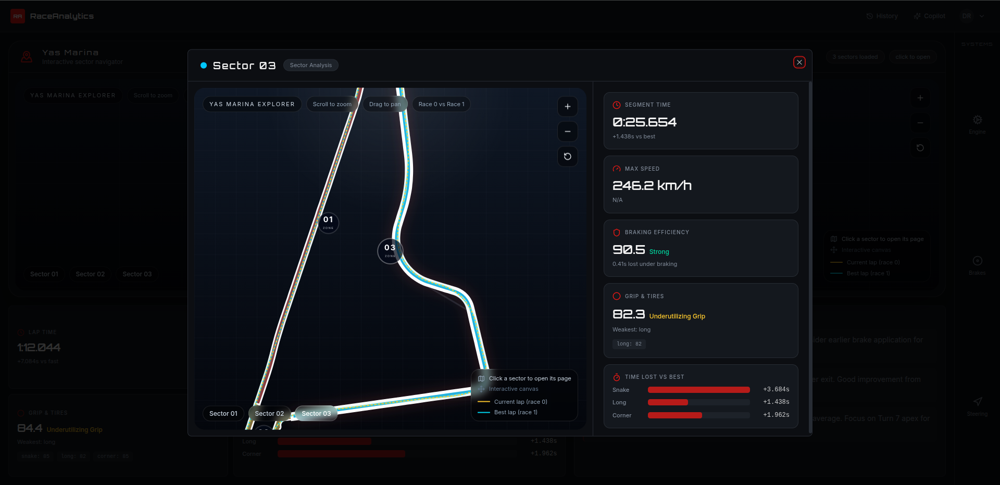
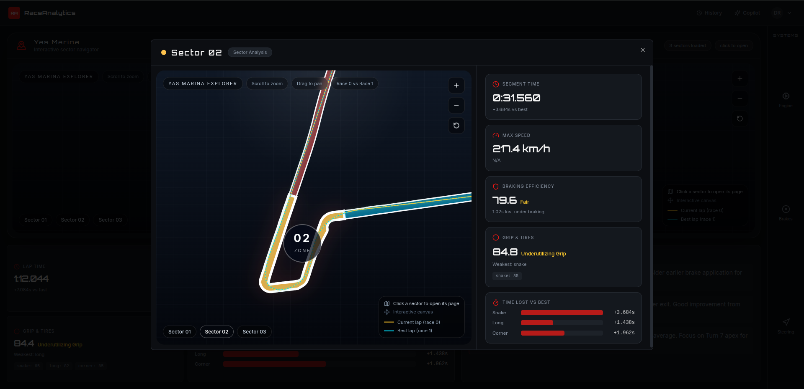

---

#### ⚙️ Car Performance Insights

**Engine**
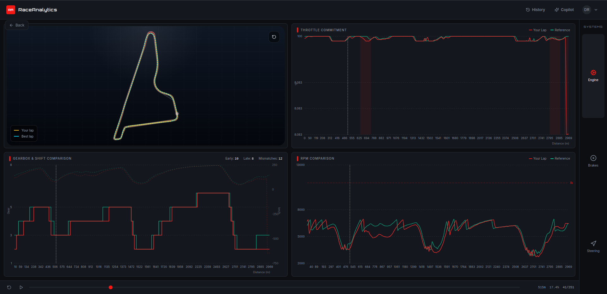

**Brakes**
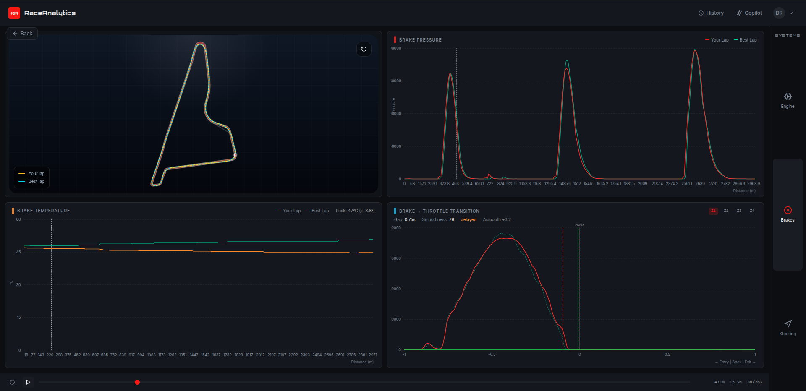

**Steering**
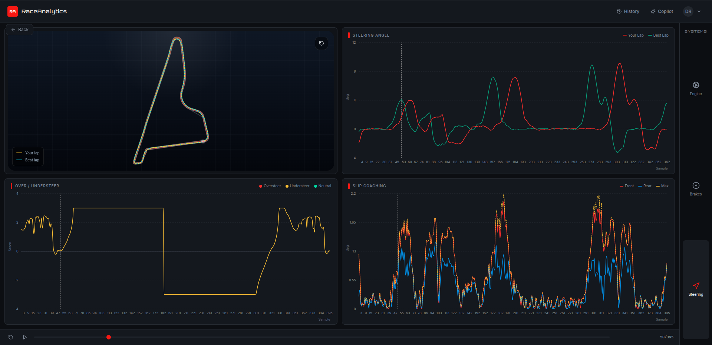

---

#### 📊 Lap History & Progress

**History Overview**
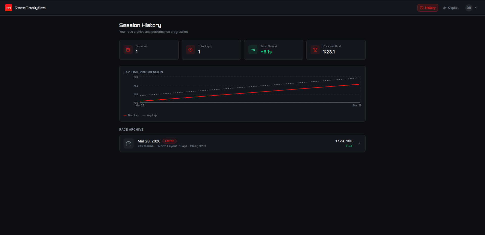

**Detailed History**
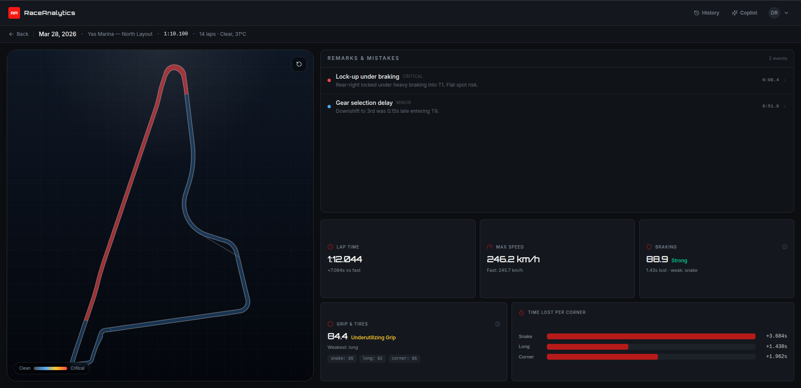

**Mistake Detection**
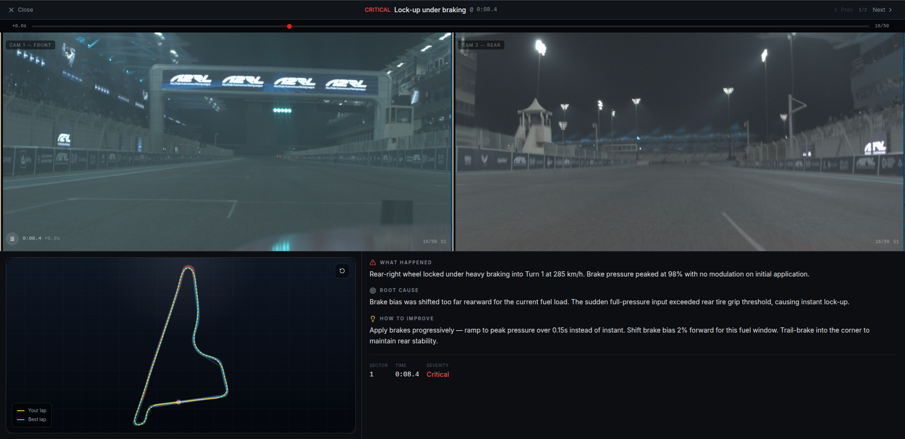
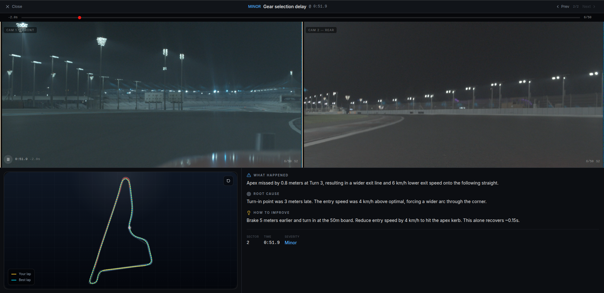

---

## Setup

RaceAnalytics is split into three services:

- `backend` (Django API + telemetry logic)
- `frontend` (Vite/React website)
- `online` (AI co-driver runtime)

This repository uses a unified Docker setup from the project root.

## Repository Layout

`backend`, `frontend`, and `online` are regular directories in this repository.
No git submodules are required.

## Prerequisites

- Docker Engine + Docker Compose plugin
- GNU Make

Quick check:

```bash
docker --version
docker compose version
make --version
```

## SQLite Setup (Data Import On First Start)

The backend now uses SQLite only.

1. Download `db.sqlite3` from:

   https://drive.google.com/file/d/1AYbhaBrA9uh3CcNDPCs65Pme8l54U3LP/view?usp=sharing

2. Put the downloaded file in the `data` folder as:

```text
data/db.sqlite3
```

3. On first backend start, Docker will copy:

```text
data/db.sqlite3  ->  data/raceanalytics.sqlite3
```

4. Django then runs migrations on `data/raceanalytics.sqlite3` and starts the API.

Notes:

- `data/db.sqlite3` is treated as the seed/source file.
- `data/raceanalytics.sqlite3` is the runtime DB used by the app.
- If `data/raceanalytics.sqlite3` already exists, no copy is done.

## Run The Website (Recommended)

From the project root:

```bash
make start
```

Then open:

- Website: http://localhost:8080
- Backend API: http://localhost:8000

## Run Only What You Need

```bash
make start_front   # frontend target
make start_back    # backend (SQLite)
make start_online  # online service
```

Aliases also available:

```bash
make make_start_front
make make_start_back
make make_start_online
make strat_online  # typo-safe alias
```

## Build Docker Images

Build all service images from `docker-compose.yml`:

```bash
docker compose -f docker-compose.yml build
```

Build one service image:

```bash
docker compose -f docker-compose.yml build backend
docker compose -f docker-compose.yml build frontend
docker compose -f docker-compose.yml build online
```

Build images directly from the unified multi-stage `Dockerfile`:

```bash
docker build -f Dockerfile --target backend  -t raceanalytics-backend:latest .
docker build -f Dockerfile --target frontend -t raceanalytics-frontend:latest .
docker build -f Dockerfile --target online   -t raceanalytics-online:latest .
```

## Stop / Restart / Logs

```bash
make stop
make restart
make logs
make ps
```

## Attach To Running Containers

```bash
make attach_front
make attach_back
make attach_online
```

## Useful Docker Commands (Without Make)

```bash
docker compose -f docker-compose.yml up -d --build
docker compose -f docker-compose.yml down
docker compose -f docker-compose.yml logs -f --tail=200
```

## Project Ports

- `8080` -> `frontend` (website)
- `8000` -> `backend` (Django API)

## Re-Import From Seed SQLite File

If you want to import again from `data/db.sqlite3`:

```bash
make stop
rm -f data/raceanalytics.sqlite3
make start_back
```

That forces a fresh copy from seed file on next backend start.

## Troubleshooting

1. Port already in use

```bash
make stop
# free ports 8080/8000 or change mappings in docker-compose.yml
```

2. Docker not running

- Start Docker Desktop/service, then retry `make start`.

3. Website is up but API calls fail

```bash
make logs
make ps
```

4. Older clone still has submodule metadata

If your local clone was created before submodules were removed:

```bash
git submodule deinit -f --all
rm -rf .git/modules/backend .git/modules/frontend .git/modules/online
```

## File Overview

- `Dockerfile`: unified multi-stage image (`backend`, `frontend`, `online`)
- `docker-compose.yml`: orchestrates all services
- `Makefile`: one-command workflow for daily use
